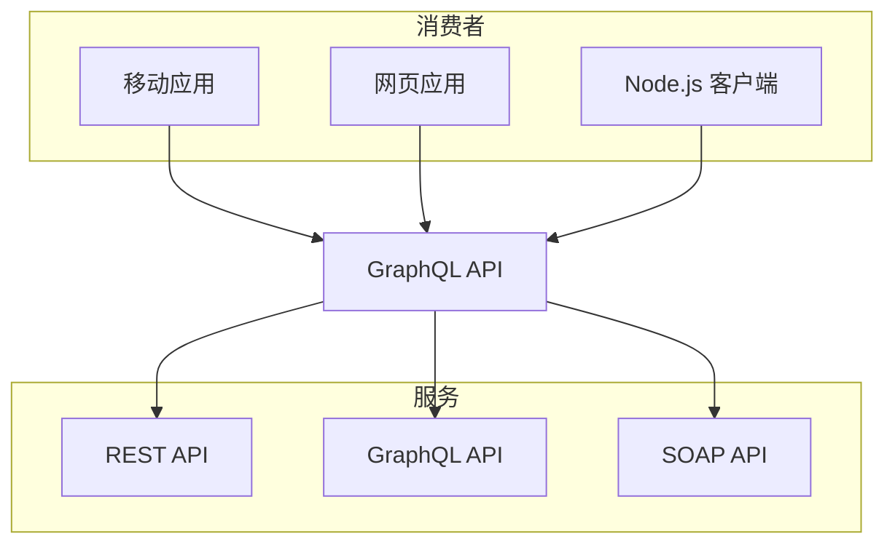

# Mermaid

Nextra 支持 [mermaid](https://mermaid.js.org) 图表。就像在 GitHub 中一样，您可以通过使用 `mermaid` 代码块语言在 markdown 文件中使用它。开箱即用，Nextra 使用
[`@theguild/remark-mermaid`](https://npmjs.com/package/@theguild/remark-mermaid)
包来替换代码块为 `<Mermaid />` 组件。

## 示例



## 使用方法

````mdx filename="Markdown"

````
